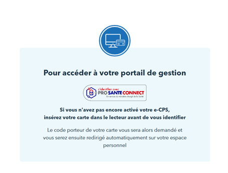
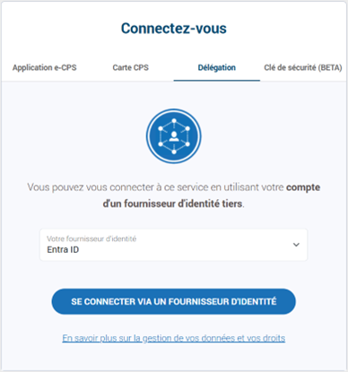
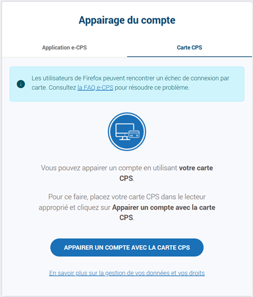
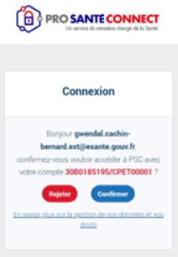

# Expérience Pro Santé Connect sans couture 

Pro Santé Connect (PSC) est le fédérateur d’identités des professionnels des secteurs sanitaire, médico-social et social enregistrés au Répertoire Partagé des Professionnels de Santé (RPPS). Ce service socle est proposé par l’Agence du Numérique en Santé (ANS) en sa qualité d’autorité compétente.

Dans le cadre du déploiement de PSC, différents retours terrains ont mis en lumière la nécessité de faire évoluer le service pour simplifier les parcours d’accès aux services connectés à PSC ; notamment dans les contextes des ES.

L’objectif du projet Pro Santé Connect sans couture est d’étudier, de définir puis d’implémenter des mesures organisationnelles et techniques permettant de fluidifier l’accès à ces services numériques dans le contexte des ES.

Pour fluidifier la navigation, une fédération/délégation peut être ainsi mise en place entre le fournisseur d’identités (FI) local de l’ES et PSC selon les contextes. 

 
 
Dans le cadre des tests préliminaire, l’application de test PSC_BAS, c.à.d. le portail de gestion des utilisateurs Bac à sable est mise à disposition à cette fin ; elle est accessible à l’adresse Internet https://wallet.bas.psc.esante.gouv.fr/login-page.

Un premier POC technique incluant le raccordement et la sécurisation avec Microsoft Entra ID vise à assoir la validité technique de la solution proposée dans le cadre de PSC sans couture, et de recueillir des retours qui auront pour vocation à permettre les évolutions et améliorations de la solution.

La délégation de l’authentification à Microsoft Entra ID est décrite dans le Guide de configuration de Pro Santé Connect à destination des établissements de santé. Elle suppose une approbation préalable de l’application PSC_BAS dans le locataire Entra ID de l’ES retenu pour cette délégation.

Une fois celle-ci en place, en termes de parcours utilisateurs, lorsqu’un professionnel de Santé (PS) accède à ce service numérique (SN) depuis son navigateur, ce dernier est renvoyé vers PSC qui le redirige alors de façon transparente vers Microsoft Entra ID. 

L’application de test permet de lancer cette cinématique en :

1.	Cliquant sur le bouton **S’identifier avec PRO SANTE CONNECT**.

 

2.	Sélectionnant **Entra ID** dans l’onglet **Délégation**.

 

3.	Cliquant sur le bouton **SE CONNECTER VIA UN FOURNISSEUR D’IDENTITE**. 
 
## Première authentification (appairage)

Si le PS n’a pas de session déjà ouverte avec Microsoft Entra ID, il se voit inviter à se connecter. Il utilise pour cela un moyen d’identification électronique (MIE) conforme avec les exigences établies par l’ANS et reconnu comme mécanisme d’authentification au niveau de ce locataire.

L’activation des différents MIE vis-à-vis desquels l’ANS invite les ES à conduire une évaluation ainsi que leur support dans Microsoft Entra ID sont couverts [ici](./IDMEANS.md).

 
 
Une fois authentifié par Microsoft Entra ID, avec le MIE conforme utilisé, et sur la base éventuellement d’une ouverture de session Windows avec la navigation sans couture, le PS est renvoyé vers PSC. 

D’un point de vue technique, le protocole utilisé dans ces redirections et échanges est le standard de l’industrie OpenID Connect (OIDC) avec le flux de code d’autorisation (authorization code flow). (Le flux de code d'autorisation permet à l'application d'échanger un code d'autorisation contre des jetons d'ID pour représenter l'utilisateur authentifié et des jetons d'accès nécessaires pour appeler des API protégées.)

A ce stade, lors d’une première authentification, le PS n’accède pas directement au service numérique mais voit faire une proposition d’appairage du compte Microsoft Entra ID qui lui a été attribué par l’ES avec sa carte CPx ou son e-CPS.

 
 
Si le PS confirme sa volonté de continuer en cliquant sur **Appairer un compte avec la carte CPS**, il est ensuite invité à utiliser sa carte CPX ou e-CPS. Une fois l’appairage réalisé, la mire précédente n’est plus affichée dans le parcours sans couture.

Seule est alors nécessaire de confirmer la validation de connexion.

**Note concernant le parcours sans couture** :  il apparait préférable que le PS n’accède pas de façon totalement transparente au service numérique, afin de faciliter la gestion des sessions utilisées.

**Exemple de cas d’usage** : dans ce contexte, une secrétaire médicale pourrait laisser un accès rapide à son appareil à un des PS de son service : lors de l’accès au service numérique, la secrétaire choisirait sur l’écran intermédiaire de ne pas se connecter via son compte appairé, mais choisirait une authentification PSC. Cela permettrait au PS d’utiliser le poste de la secrétaire pour réaliser une tâche rapide et de se déconnecter par la suite. 

 
 
Après avoir cliqué sur **Confirmer**, le PS accède au portail de gestion PSC BAS. 
 
## Authentification depuis l’ouverture de session d’un appareil Windows

Si l’authentification réalisée lors de l’ouverture de session satisfait aux exigences du Référentiel d’Identification Electronique (RIE), la mire de connexion Entra ID précédente n’est pas affiché dans le parcours sans couture et le PS bénéficie ici alors d’un accès transparent à l’ensemble des applications raccordés au FI local ainsi qu’à l’ensemble de l’écosystème PSC et ses services numériques (SN). 

Une ouverte de session par carte à puce avec une carte CPx réalisée depuis un poste de travail Windows avec une jointure (hybride) à Entra ID permet de satisfaire aux exigences du RIE.

Pour l’accès à l’écosystème PSC, seule la confirmation de la validation de connexion est alors nécessaire pour les mêmes raisons qu’évoquées précédemment.